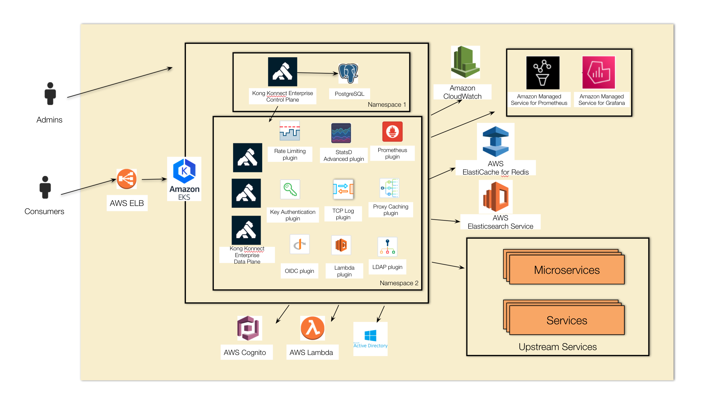
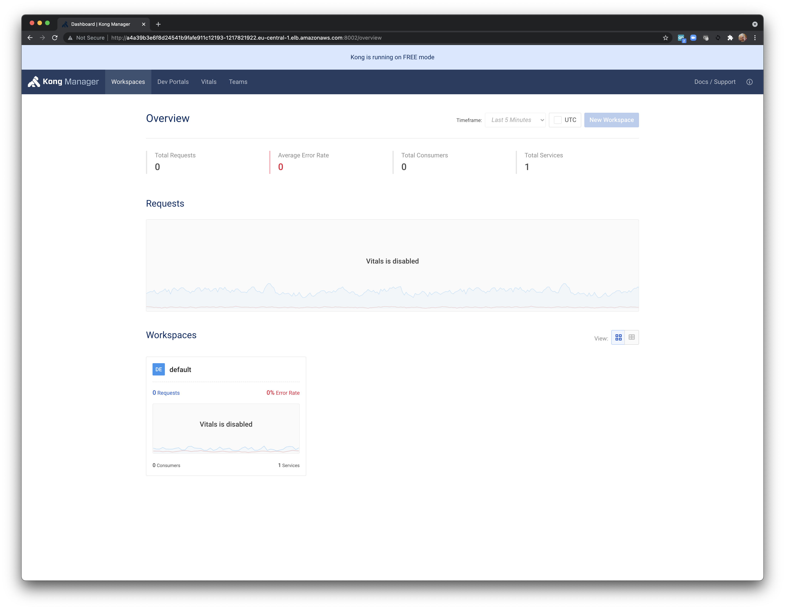
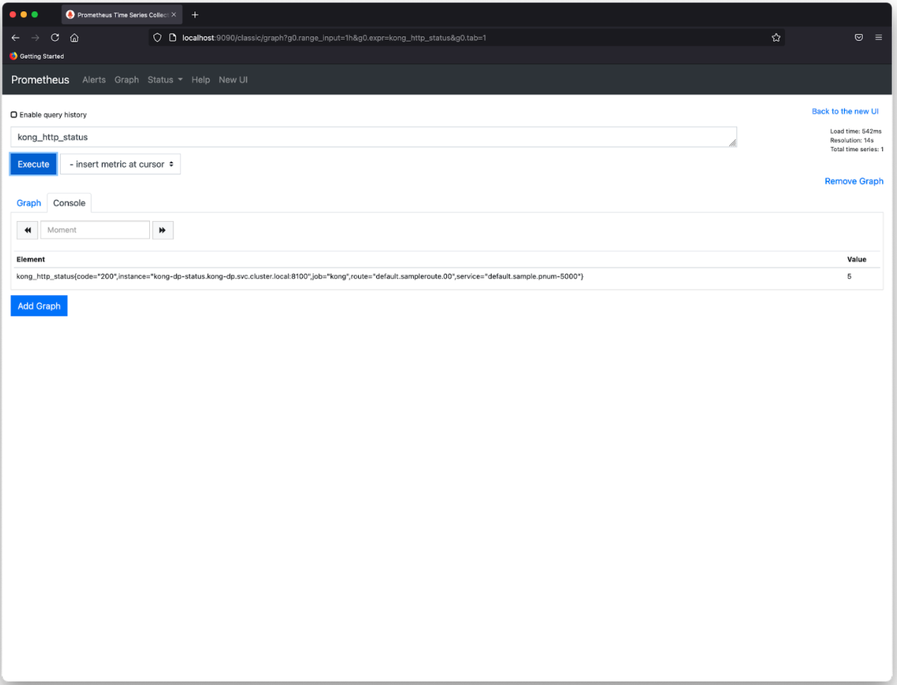
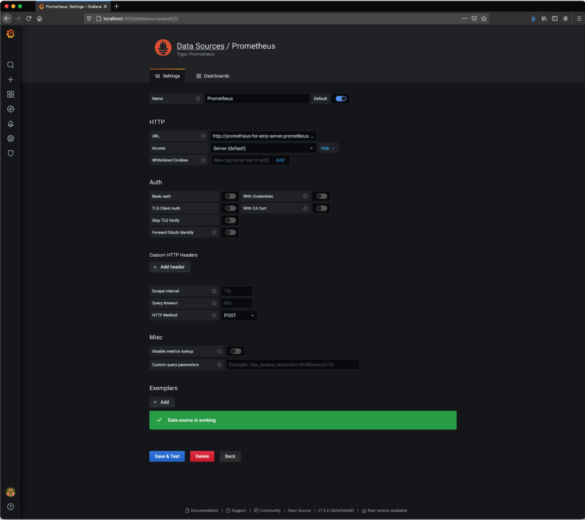
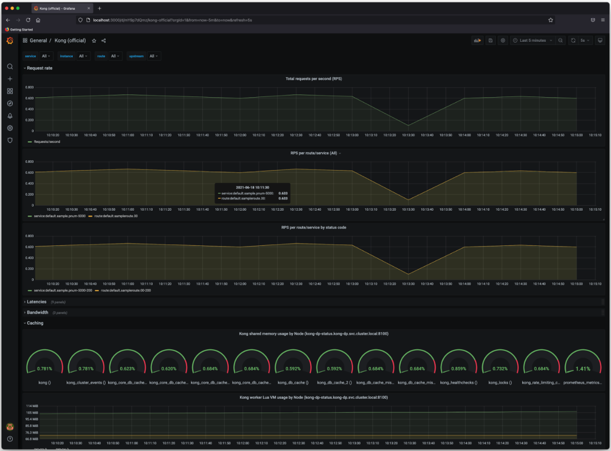

# Kong Konnect Enterprise Hybrid Mode

One of the most powerful capabilities provided by Kong Konnect Enterprise is the support for Hybrid deployments. In other words, it implements distributed API Gateway Clusters with multiple instances running on several environments at the same time.

Moreover, Kong Konnect Enterprise provides a new topology option, named Hybrid Mode, with a total separation of the Control Plane (CP) and Data Plane (DP). That is, while the Control Plane is responsible for administration tasks, the Data Plane is exclusively used by API Consumers.

Please, refer to the following link to read more about the Hybrid deployment: [https://docs.konghq.com/enterprise/2.4.x/deployment/hybrid-mode/](https://docs.konghq.com/enterprise/2.4.x/deployment/hybrid-mode/)


### Reference Architecture

Here's a Reference Architecture implemented in AWS:


*   The Control Plane runs as a Docker container on an EC2 instance. Notice the PostgreSQL RDS Database is located behind the CP.
*   The first Data Plane runs as another Docker container on a different EC2 instance.
*   The second Data Plane runs on an Elastic Kubernetes Service (EKS) Cluster.





Considering the capabilities provided by the Kubernetes platform, running Data Planes on this platform delivers a powerful environment. Here are some capabilities leveraged by the Data Plane on Kubernetes:


*   High Availability: One of the main Kubernetes' capabilities is "Self-Healing". If a "pod" crashes, Kubernetes takes care of it, reinitializing the "pod".
*   Scalability/Elasticity: HPA ("Horizontal Pod Autoscaler") is the capability to initialize and terminate "pod" replicas based on previously defined policies. The policies define "thresholds" to tell Kubernetes the conditions where it should initiate a brand new "pod" replica or terminate a running one.
*   Load Balancing: The Kubernetes Service notion defines an abstraction level on top of the "pod" replicas that might have been up or down (due HPA policies, for instance). Kubernetes keeps all the "pod" replicas hidden from the "callers" through Services.

**Important remark #1:** this tutorial is intended to be used for labs and PoC only. There are many aspects and processes, typically implemented in production sites, not described here. For example: Digital Certificate issuing, Cluster monitoring, etc.

**Important remark #2:** the deployment is based on Kong Enterprise 2.3. Please contact Kong to get a Kong Enterprise trial license to run this lab.


# 


# Kong Konnect Enterprise & Elastic Kubernetes Service (EKS)


### Pre-requisites

The tutorial assumes you have already installed the following products:


*   eksctl
*   kubectl  
*   httpie and curl
*   jq
*   fortio


# Creating an EKS Cluster


### AWS Login

We are going to build our environment in eu-central-1 (Frankfurt) region.


```
$ aws configure
AWS Access Key ID [****************XNFA]: 
AWS Secret Access Key [****************dlT5]: 
Default region name [eu-central-1]: 
Default output format [json]: 
```


### Creating an EKS Cluster

`eksctl` creates implicitly a specific VPC for our EKS Cluster.


```
$ eksctl create cluster --name K4K8S --version 1.20 --region eu-central-1 --without-nodegroup --nodes 1
2021-06-19 16:23:19 [ℹ]  eksctl version 0.54.0
2021-06-19 16:23:19 [ℹ]  using region eu-central-1
2021-06-19 16:23:20 [ℹ]  setting availability zones to [eu-central-1b eu-central-1c eu-central-1a]
2021-06-19 16:23:20 [ℹ]  subnets for eu-central-1b - public:192.168.0.0/19 private:192.168.96.0/19
2021-06-19 16:23:20 [ℹ]  subnets for eu-central-1c - public:192.168.32.0/19 private:192.168.128.0/19
2021-06-19 16:23:20 [ℹ]  subnets for eu-central-1a - public:192.168.64.0/19 private:192.168.160.0/19
2021-06-19 16:23:20 [ℹ]  using Kubernetes version 1.20
2021-06-19 16:23:20 [ℹ]  creating EKS cluster "K4K8S" in "eu-central-1" region with 
2021-06-19 16:23:20 [ℹ]  if you encounter any issues, check CloudFormation console or try 'eksctl utils describe-stacks --region=eu-central-1 --cluster=K4K8S'
2021-06-19 16:23:20 [ℹ]  CloudWatch logging will not be enabled for cluster "K4K8S" in "eu-central-1"
2021-06-19 16:23:20 [ℹ]  you can enable it with 'eksctl utils update-cluster-logging --enable-types={SPECIFY-YOUR-LOG-TYPES-HERE (e.g. all)} --region=eu-central-1 --cluster=K4K8S'
2021-06-19 16:23:20 [ℹ]  Kubernetes API endpoint access will use default of {publicAccess=true, privateAccess=false} for cluster "K4K8S" in "eu-central-1"
2021-06-19 16:23:20 [ℹ]  2 sequential tasks: { create cluster control plane "K4K8S", 2 sequential sub-tasks: { wait for control plane to become ready, 1 task: { create addons } } }
2021-06-19 16:23:20 [ℹ]  building cluster stack "eksctl-K4K8S-cluster"
2021-06-19 16:23:22 [ℹ]  deploying stack "eksctl-K4K8S-cluster"
2021-06-19 16:23:52 [ℹ]  waiting for CloudFormation stack "eksctl-K4K8S-cluster"
2021-06-19 16:24:24 [ℹ]  waiting for CloudFormation stack "eksctl-K4K8S-cluster"
2021-06-19 16:25:25 [ℹ]  waiting for CloudFormation stack "eksctl-K4K8S-cluster"
2021-06-19 16:26:26 [ℹ]  waiting for CloudFormation stack "eksctl-K4K8S-cluster"
2021-06-19 16:27:27 [ℹ]  waiting for CloudFormation stack "eksctl-K4K8S-cluster"
2021-06-19 16:28:28 [ℹ]  waiting for CloudFormation stack "eksctl-K4K8S-cluster"
2021-06-19 16:29:29 [ℹ]  waiting for CloudFormation stack "eksctl-K4K8S-cluster"
2021-06-19 16:30:30 [ℹ]  waiting for CloudFormation stack "eksctl-K4K8S-cluster"
2021-06-19 16:31:31 [ℹ]  waiting for CloudFormation stack "eksctl-K4K8S-cluster"
2021-06-19 16:32:32 [ℹ]  waiting for CloudFormation stack "eksctl-K4K8S-cluster"
2021-06-19 16:33:33 [ℹ]  waiting for CloudFormation stack "eksctl-K4K8S-cluster"
2021-06-19 16:34:35 [ℹ]  waiting for CloudFormation stack "eksctl-K4K8S-cluster"
2021-06-19 16:38:45 [ℹ]  waiting for the control plane availability...
2021-06-19 16:38:45 [✔]  saved kubeconfig as "/Users/claudio/.kube/config"
2021-06-19 16:38:45 [ℹ]  no tasks
2021-06-19 16:38:45 [✔]  all EKS cluster resources for "K4K8S" have been created
2021-06-19 16:40:52 [ℹ]  kubectl command should work with "/Users/claudio/.kube/config", try 'kubectl get nodes'
2021-06-19 16:40:52 [✔]  EKS cluster "K4K8S" in "eu-central-1" region is ready

$ eksctl get cluster
2021-06-19 16:41:18 [ℹ]  eksctl version 0.54.0
2021-06-19 16:41:18 [ℹ]  using region eu-central-1
NAME		REGION		EKSCTL CREATED
K4K8S		eu-central-1	True
```


### Creating the NodeGroup


```
$ kubectl get node
No resources found

$ eksctl create nodegroup --cluster K4K8S --name K4K8S-node --region eu-central-1 --node-type m5.xlarge --nodes 1 --max-pods-per-node 50
2021-06-19 16:43:04 [ℹ]  eksctl version 0.54.0
2021-06-19 16:43:04 [ℹ]  using region eu-central-1
2021-06-19 16:43:05 [ℹ]  will use version 1.20 for new nodegroup(s) based on control plane version
2021-06-19 16:43:13 [ℹ]  nodegroup "K4K8S-node" will use "ami-00e3430a783549791" [AmazonLinux2/1.20]
2021-06-19 16:43:15 [ℹ]  1 nodegroup (K4K8S-node) was included (based on the include/exclude rules)
2021-06-19 16:43:15 [ℹ]  will create a CloudFormation stack for each of 1 nodegroups in cluster "K4K8S"
2021-06-19 16:43:16 [ℹ]  2 sequential tasks: { fix cluster compatibility, 1 task: { 1 task: { create nodegroup "K4K8S-node" } } }
2021-06-19 16:43:16 [ℹ]  checking cluster stack for missing resources
2021-06-19 16:43:17 [ℹ]  cluster stack has all required resources
2021-06-19 16:43:17 [ℹ]  building nodegroup stack "eksctl-K4K8S-nodegroup-K4K8S-node"
2021-06-19 16:43:17 [ℹ]  --nodes-min=1 was set automatically for nodegroup K4K8S-node
2021-06-19 16:43:17 [ℹ]  --nodes-max=1 was set automatically for nodegroup K4K8S-node
2021-06-19 16:43:18 [ℹ]  deploying stack "eksctl-K4K8S-nodegroup-K4K8S-node"
2021-06-19 16:43:18 [ℹ]  waiting for CloudFormation stack "eksctl-K4K8S-nodegroup-K4K8S-node"
2021-06-19 16:43:34 [ℹ]  waiting for CloudFormation stack "eksctl-K4K8S-nodegroup-K4K8S-node"
2021-06-19 16:43:52 [ℹ]  waiting for CloudFormation stack "eksctl-K4K8S-nodegroup-K4K8S-node"
2021-06-19 16:44:13 [ℹ]  waiting for CloudFormation stack "eksctl-K4K8S-nodegroup-K4K8S-node"
2021-06-19 16:44:31 [ℹ]  waiting for CloudFormation stack "eksctl-K4K8S-nodegroup-K4K8S-node"
2021-06-19 16:44:52 [ℹ]  waiting for CloudFormation stack "eksctl-K4K8S-nodegroup-K4K8S-node"
2021-06-19 16:45:12 [ℹ]  waiting for CloudFormation stack "eksctl-K4K8S-nodegroup-K4K8S-node"
2021-06-19 16:45:32 [ℹ]  waiting for CloudFormation stack "eksctl-K4K8S-nodegroup-K4K8S-node"
2021-06-19 16:45:50 [ℹ]  waiting for CloudFormation stack "eksctl-K4K8S-nodegroup-K4K8S-node"
2021-06-19 16:46:09 [ℹ]  waiting for CloudFormation stack "eksctl-K4K8S-nodegroup-K4K8S-node"
2021-06-19 16:46:27 [ℹ]  waiting for CloudFormation stack "eksctl-K4K8S-nodegroup-K4K8S-node"
2021-06-19 16:46:44 [ℹ]  waiting for CloudFormation stack "eksctl-K4K8S-nodegroup-K4K8S-node"
2021-06-19 16:47:04 [ℹ]  waiting for CloudFormation stack "eksctl-K4K8S-nodegroup-K4K8S-node"
2021-06-19 16:47:20 [ℹ]  waiting for CloudFormation stack "eksctl-K4K8S-nodegroup-K4K8S-node"
2021-06-19 16:47:22 [ℹ]  no tasks
2021-06-19 16:47:23 [ℹ]  adding identity "arn:aws:iam::151743893450:role/eksctl-K4K8S-nodegroup-K4K8S-node-NodeInstanceRole-HWCF8G6IP5CG" to auth ConfigMap
2021-06-19 16:47:24 [ℹ]  nodegroup "K4K8S-node" has 0 node(s)
2021-06-19 16:47:24 [ℹ]  waiting for at least 1 node(s) to become ready in "K4K8S-node"
2021-06-19 16:48:01 [ℹ]  nodegroup "K4K8S-node" has 1 node(s)
2021-06-19 16:48:01 [ℹ]  node "ip-192-168-90-244.eu-central-1.compute.internal" is ready
2021-06-19 16:48:01 [✔]  created 1 nodegroup(s) in cluster "K4K8S"
2021-06-19 16:48:01 [✔]  created 0 managed nodegroup(s) in cluster "K4K8S"
2021-06-19 16:48:03 [ℹ]  checking security group configuration for all nodegroups
2021-06-19 16:48:03 [ℹ]  all nodegroups have up-to-date configuration

$ kubectl get node
NAME                                              STATUS   ROLES    AGE   VERSION
ip-192-168-90-244.eu-central-1.compute.internal   Ready    <none>   3m    v1.20.4-eks-6b7464

$ kubectl describe node
Name:               ip-192-168-90-244.eu-central-1.compute.internal
Roles:              <none>
Labels:             alpha.eksctl.io/cluster-name=K4K8S
                    alpha.eksctl.io/instance-id=i-07431d84de6a95737
                    alpha.eksctl.io/nodegroup-name=K4K8S-node
                    beta.kubernetes.io/arch=amd64
                    beta.kubernetes.io/instance-type=m5.xlarge
                    beta.kubernetes.io/os=linux
                    failure-domain.beta.kubernetes.io/region=eu-central-1
                    failure-domain.beta.kubernetes.io/zone=eu-central-1a
                    kubernetes.io/arch=amd64
                    kubernetes.io/hostname=ip-192-168-90-244.eu-central-1.compute.internal
                    kubernetes.io/os=linux
                    node-lifecycle=on-demand
                    node.kubernetes.io/instance-type=m5.xlarge
                    topology.kubernetes.io/region=eu-central-1
                    topology.kubernetes.io/zone=eu-central-1a
Annotations:        node.alpha.kubernetes.io/ttl: 0
                    volumes.kubernetes.io/controller-managed-attach-detach: true
CreationTimestamp:  Sat, 19 Jun 2021 16:47:30 -0300
Taints:             <none>
Unschedulable:      false
Lease:
  HolderIdentity:  ip-192-168-90-244.eu-central-1.compute.internal
  AcquireTime:     <unset>
  RenewTime:       Sat, 19 Jun 2021 16:50:50 -0300
Conditions:
  Type             Status  LastHeartbeatTime                 LastTransitionTime                Reason                       Message
  ----             ------  -----------------                 ------------------                ------                       -------
  MemoryPressure   False   Sat, 19 Jun 2021 16:48:40 -0300   Sat, 19 Jun 2021 16:47:30 -0300   KubeletHasSufficientMemory   kubelet has sufficient memory available
  DiskPressure     False   Sat, 19 Jun 2021 16:48:40 -0300   Sat, 19 Jun 2021 16:47:30 -0300   KubeletHasNoDiskPressure     kubelet has no disk pressure
  PIDPressure      False   Sat, 19 Jun 2021 16:48:40 -0300   Sat, 19 Jun 2021 16:47:30 -0300   KubeletHasSufficientPID      kubelet has sufficient PID available
  Ready            True    Sat, 19 Jun 2021 16:48:40 -0300   Sat, 19 Jun 2021 16:48:00 -0300   KubeletReady                 kubelet is posting ready status
Addresses:
  InternalIP:   192.168.90.244
  ExternalIP:   3.126.116.120
  Hostname:     ip-192-168-90-244.eu-central-1.compute.internal
  InternalDNS:  ip-192-168-90-244.eu-central-1.compute.internal
  ExternalDNS:  ec2-3-126-116-120.eu-central-1.compute.amazonaws.com
Capacity:
  attachable-volumes-aws-ebs:  25
  cpu:                         4
  ephemeral-storage:           83873772Ki
  hugepages-1Gi:               0
  hugepages-2Mi:               0
  memory:                      15921668Ki
  pods:                        50
Allocatable:
  attachable-volumes-aws-ebs:  25
  cpu:                         3920m
  ephemeral-storage:           76224326324
  hugepages-1Gi:               0
  hugepages-2Mi:               0
  memory:                      14904836Ki
  pods:                        50
System Info:
  Machine ID:                 ec2d871acac26dc457d0cf8c6cea8cf3
  System UUID:                ec2d871a-cac2-6dc4-57d0-cf8c6cea8cf3
  Boot ID:                    0f8dcf64-a6a2-4ae4-a809-ffbfec8e30fb
  Kernel Version:             5.4.117-58.216.amzn2.x86_64
  OS Image:                   Amazon Linux 2
  Operating System:           linux
  Architecture:               amd64
  Container Runtime Version:  docker://19.3.13
  Kubelet Version:            v1.20.4-eks-6b7464
  Kube-Proxy Version:         v1.20.4-eks-6b7464
ProviderID:                   aws:///eu-central-1a/i-07431d84de6a95737
Non-terminated Pods:          (4 in total)
  Namespace                   Name                       CPU Requests  CPU Limits  Memory Requests  Memory Limits  Age
  ---------                   ----                       ------------  ----------  ---------------  -------------  ---
  kube-system                 aws-node-mjzt9             10m (0%)      0 (0%)      0 (0%)           0 (0%)         3m21s
  kube-system                 coredns-85cc4f6d5-swj9w    100m (2%)     0 (0%)      70Mi (0%)        170Mi (1%)     18m
  kube-system                 coredns-85cc4f6d5-w6dtw    100m (2%)     0 (0%)      70Mi (0%)        170Mi (1%)     18m
  kube-system                 kube-proxy-7xxpf           100m (2%)     0 (0%)      0 (0%)           0 (0%)         3m21s
Allocated resources:
  (Total limits may be over 100 percent, i.e., overcommitted.)
  Resource                    Requests    Limits
  --------                    --------    ------
  cpu                         310m (7%)   0 (0%)
  memory                      140Mi (0%)  340Mi (2%)
  ephemeral-storage           0 (0%)      0 (0%)
  hugepages-1Gi               0 (0%)      0 (0%)
  hugepages-2Mi               0 (0%)      0 (0%)
  attachable-volumes-aws-ebs  0           0
Events:
  Type    Reason    Age   From        Message
  ----    ------    ----  ----        -------
  Normal  Starting  3m5s  kube-proxy  Starting kube-proxy.
```


### Checking the EKS Cluster


```
$ kubectl get pod --all-namespaces
NAMESPACE     NAME                      READY   STATUS    RESTARTS   AGE
kube-system   aws-node-mjzt9            1/1     Running   0          4m25s
kube-system   coredns-85cc4f6d5-swj9w   1/1     Running   0          19m
kube-system   coredns-85cc4f6d5-w6dtw   1/1     Running   0          19m
kube-system   kube-proxy-7xxpf          1/1     Running   0          4m25s

$ kubectl get service --all-namespaces
NAMESPACE     NAME         TYPE        CLUSTER-IP    EXTERNAL-IP   PORT(S)         AGE
default       kubernetes   ClusterIP   10.100.0.1    <none>        443/TCP         20m
kube-system   kube-dns     ClusterIP   10.100.0.10   <none>        53/UDP,53/TCP   20m
```


### Deleting the EKS Cluster

In case you need to delete it, run the following command:


```
eksctl delete cluster --name K4K8S
```


# 


# Sample App Installation


### Deploy Sample App


```
cat <<EOF | kubectl apply -f -
apiVersion: v1
kind: Service
metadata:
  name: sample
  namespace: default
  labels:
    app: sample
spec:
  type: ClusterIP
  ports:
  - port: 5000
    name: http
  selector:
    app: sample
---
apiVersion: apps/v1
kind: Deployment
metadata:
  name: sample
  namespace: default
spec:
  replicas: 1
  selector:
    matchLabels:
      app: sample
  template:
    metadata:
      labels:
        app: sample
        version: v1
    spec:
      containers:
      - name: sample
        image: claudioacquaviva/sampleapp
        ports:
        - containerPort: 5000
EOF

$ kubectl get services --all-namespaces
NAMESPACE     NAME         TYPE        CLUSTER-IP      EXTERNAL-IP   PORT(S)         AGE
default       kubernetes   ClusterIP   10.100.0.1      <none>        443/TCP         44h
default       sample       ClusterIP   10.100.14.211   <none>        5000/TCP        29s
kube-system   kube-dns     ClusterIP   10.100.0.10     <none>        53/UDP,53/TCP   44h

$ kubectl get pod --all-namespaces
NAMESPACE     NAME                      READY   STATUS    RESTARTS   AGE
default       sample-76db6bb547-vdl95   1/1     Running   0          47s
kube-system   aws-node-f7dbp            1/1     Running   0          44h
kube-system   coredns-85cc4f6d5-4hcrs   1/1     Running   0          44h
kube-system   coredns-85cc4f6d5-ttsm2   1/1     Running   0          44h
kube-system   kube-proxy-kgwq7          1/1     Running   0          44h

$ kubectl port-forward service/sample 5000

$ http localhost:5000/hello
HTTP/1.0 200 OK
Content-Length: 45
Content-Type: text/html; charset=utf-8
Date: Tue, 15 Jun 2021 13:21:25 GMT
Server: Werkzeug/1.0.1 Python/3.7.4

Hello World, Kong: 2021-06-15 13:21:25.806664
```


### Deleting the application


```
kubectl delete service sample
kubectl delete deployment sample
```


# 


# Kong Konnect Enterprise Control Plane

Create a "kong" namespace


```
kubectl create namespace kong
```


### Generating Private Key and Digital Certificate


```
openssl req -new -x509 -nodes -newkey ec:<(openssl ecparam -name secp384r1) \
  -keyout ./cluster.key -out ./cluster.crt \
  -days 1095 -subj "/CN=kong_clustering"

kubectl create secret tls kong-cluster-cert --cert=./cluster.crt --key=./cluster.key -n kong
```


### Control Plane


```
helm install kong kong/kong -n kong \
--set ingressController.enabled=true \
--set ingressController.installCRDs=false \
--set ingressController.image.repository=kong/kubernetes-ingress-controller \
--set ingressController.image.tag=1.3.1-alpine \
--set image.repository=kong/kong-gateway \
--set image.tag=2.4.1.1-alpine \
--set env.database=postgres \
--set env.role=control_plane \
--set env.cluster_cert=/etc/secrets/kong-cluster-cert/tls.crt \
--set env.cluster_cert_key=/etc/secrets/kong-cluster-cert/tls.key \
--set cluster.enabled=true \
--set cluster.tls.enabled=true \
--set cluster.tls.servicePort=8005 \
--set cluster.tls.containerPort=8005 \
--set clustertelemetry.enabled=true \
--set clustertelemetry.tls.enabled=true \
--set clustertelemetry.tls.servicePort=8006 \
--set clustertelemetry.tls.containerPort=8006 \
--set proxy.enabled=true \
--set admin.enabled=true \
--set admin.http.enabled=true \
--set admin.type=LoadBalancer \
--set enterprise.enabled=true \
--set enterprise.portal.enabled=false \
--set enterprise.rbac.enabled=false \
--set enterprise.smtp.enabled=false \
--set manager.enabled=true \
--set manager.type=LoadBalancer \
--set secretVolumes[0]=kong-cluster-cert \
--set postgresql.enabled=true \
--set postgresql.postgresqlUsername=kong \
--set postgresql.postgresqlDatabase=kong \
--set postgresql.postgresqlPassword=kong
```


### Data Plane


```
kubectl create namespace kong-dp

kubectl create secret tls kong-cluster-cert --cert=./cluster.crt --key=./cluster.key -n kong-dp

helm install kong-dp kong/kong -n kong-dp \
--set ingressController.enabled=false \
--set image.repository=kong/kong-gateway \
--set image.tag=2.4.1.1-alpine \
--set env.database=off \
--set env.role=data_plane \
--set env.cluster_cert=/etc/secrets/kong-cluster-cert/tls.crt \
--set env.cluster_cert_key=/etc/secrets/kong-cluster-cert/tls.key \
--set env.lua_ssl_trusted_certificate=/etc/secrets/kong-cluster-cert/tls.crt \
--set env.cluster_control_plane=kong-kong-cluster.kong.svc.cluster.local:8005 \
--set env.cluster_telemetry_endpoint=kong-kong-clustertelemetry.kong.svc.cluster.local:8006 \
--set proxy.enabled=true \
--set proxy.type=LoadBalancer \
--set enterprise.enabled=true \
--set enterprise.portal.enabled=false \
--set enterprise.rbac.enabled=false \
--set enterprise.smtp.enabled=false \
--set manager.enabled=false \
--set portal.enabled=false \
--set portalapi.enabled=false \
--set env.status_listen=0.0.0.0:8100 \
--set secretVolumes[0]=kong-cluster-cert
```


### Checking the Installation


```
$ kubectl get deployment --all-namespaces
NAMESPACE     NAME           READY   UP-TO-DATE   AVAILABLE   AGE
default       sample         1/1     1            1           3d
kong-dp       kong-dp-kong   1/1     1            1           11s
kong          kong-kong      1/1     1            1           109s
kube-system   coredns        2/2     2            2           4d21h

$ kubectl get service --all-namespaces
NAMESPACE     NAME                         TYPE           CLUSTER-IP       EXTERNAL-IP                                                                  PORT(S)                         AGE
default       kubernetes                   ClusterIP      10.100.0.1       <none>                                                                       443/TCP                         4d21h
default       sample                       ClusterIP      10.100.14.211    <none>                                                                       5000/TCP                        3d
kong-dp       kong-dp-kong-proxy           LoadBalancer   10.100.246.232   a9aff6f5e76cb44388de626142125910-1237564813.eu-central-1.elb.amazonaws.com   80:32434/TCP,443:30057/TCP      18s
kong          kong-kong-admin              LoadBalancer   10.100.231.236   a382fa31838774a15a22010b64dcad7f-1251774649.eu-central-1.elb.amazonaws.com   8001:30292/TCP,8444:31224/TCP   116s
kong          kong-kong-cluster            ClusterIP      10.100.50.207    <none>                                                                       8005/TCP                        116s
kong          kong-kong-clustertelemetry   ClusterIP      10.100.152.57    <none>                                                                       8006/TCP                        116s
kong          kong-kong-manager            LoadBalancer   10.100.237.78    a7182c9757499490a8a89e370d13a74e-1144016641.eu-central-1.elb.amazonaws.com   8002:30177/TCP,8445:30489/TCP   116s
kong          kong-kong-portal             NodePort       10.100.70.140    <none>                                                                       8003:31632/TCP,8446:30989/TCP   116s
kong          kong-kong-portalapi          NodePort       10.100.42.51     <none>                                                                       8004:31128/TCP,8447:31976/TCP   116s
kong          kong-kong-proxy              LoadBalancer   10.100.34.44     a1ae6f60b939a4a7398c2b9cca78f41e-1054571476.eu-central-1.elb.amazonaws.com   80:32230/TCP,443:31583/TCP      116s
kong          kong-postgresql              ClusterIP      10.100.63.120    <none>                                                                       5432/TCP                        116s
kong          kong-postgresql-headless     ClusterIP      None             <none>                                                                       5432/TCP                        116s
kube-system   kube-dns                     ClusterIP      10.100.0.10      <none>                                                                       53/UDP,53/TCP                   4d21h

$ kubectl get pod --all-namespaces
NAMESPACE     NAME                              READY   STATUS      RESTARTS   AGE
default       sample-76db6bb547-vdl95           1/1     Running     0          3d
kong-dp       kong-dp-kong-69d9486f9d-464xf     1/1     Running     0          24s
kong          kong-kong-74c6f866d4-nmbfs        2/2     Running     0          2m2s
kong          kong-kong-init-migrations-d4jms   0/1     Completed   0          2m1s
kong          kong-postgresql-0                 1/1     Running     0          2m1s
kube-system   aws-node-f7dbp                    1/1     Running     0          4d21h
kube-system   coredns-85cc4f6d5-4hcrs           1/1     Running     0          4d21h
kube-system   coredns-85cc4f6d5-ttsm2           1/1     Running     0          4d21h
kube-system   kube-proxy-kgwq7                  1/1     Running     0          4d21h
```


### Configuring Kong Manager Service


```
# kubectl get svc -n kong kong-kong-admin --output=jsonpath='{.status.loadBalancer.ingress[0].hostname}'
a382fa31838774a15a22010b64dcad7f-1251774649.eu-central-1.elb.amazonaws.com

kubectl patch deployment -n kong kong-kong -p "{\"spec\": { \"template\" : { \"spec\" : {\"containers\":[{\"name\":\"proxy\",\"env\": [{ \"name\" : \"KONG_ADMIN_API_URI\", \"value\": \"a382fa31838774a15a22010b64dcad7f-1251774649.eu-central-1.elb.amazonaws.com:8001\" }]}]}}}}"
```


### Checking the Admin

Use the Load Balancer created during the deployment


```
$ http a382fa31838774a15a22010b64dcad7f-1251774649.eu-central-1.elb.amazonaws.com:8001 | jq .version
"2.4.1.1-enterprise-edition"
```


### Checking the Data Plane from the Control Plane


```
$ http a382fa31838774a15a22010b64dcad7f-1251774649.eu-central-1.elb.amazonaws.com:8001/clustering/status
HTTP/1.1 200 OK
Access-Control-Allow-Origin: *
Connection: keep-alive
Content-Length: 178
Content-Type: application/json; charset=utf-8
Date: Fri, 18 Jun 2021 13:55:27 GMT
Deprecation: true
Server: kong/2.4.1.1-enterprise-edition
X-Kong-Admin-Latency: 11
X-Kong-Admin-Request-ID: HBtaUpGJFMKSA5Mqaj0BUxT8yLsWa21I
vary: Origin

{
    "9e3e77e4-1787-48c5-b891-e64d05ba2eb1": {
        "config_hash": "6085b343870b77813c810834abf70216",
        "hostname": "kong-dp-kong-69d9486f9d-464xf",
        "ip": "192.168.81.32",
        "last_seen": 1624024517
    }
}
```


### Checking the Proxy

Use the Load Balancer created during the deployment


```
kubectl get svc -n kong-dp kong-dp-kong-proxy --output=jsonpath='{.status.loadBalancer.ingress[0].hostname}'
ae467f50662774bfbaf0524fe1acf9e7-1099403495.eu-central-1.elb.amazonaws.com

$ http ae467f50662774bfbaf0524fe1acf9e7-1099403495.eu-central-1.elb.amazonaws.com
HTTP/1.1 404 Not Found
Connection: keep-alive
Content-Length: 48
Content-Type: application/json; charset=utf-8
Date: Fri, 18 Jun 2021 13:57:02 GMT
Server: kong/2.4.1.1-enterprise-edition
X-Kong-Response-Latency: 2

{
    "message": "no Route matched with those values"
}
```


### Logging to Kong Manager

Login to Kong Manager using the specific ELB:


```
$ kubectl get svc -n kong kong-kong-manager --output=jsonpath='{.status.loadBalancer.ingress[0].hostname}'
a7182c9757499490a8a89e370d13a74e-1144016641.eu-central-1.elb.amazonaws.com
```


[http://a7182c9757499490a8a89e370d13a74e-1144016641.eu-central-1.elb.amazonaws.com:8002](http://a7182c9757499490a8a89e370d13a74e-1144016641.eu-central-1.elb.amazonaws.com:8002)





## Ingress Creation


### Kubernetes External Service


```
cat <<EOF | kubectl apply -f -
apiVersion: v1
kind: Service
metadata:
  name: route1-ext
  namespace: default
spec:
  type: ExternalName
  externalName: httpbin.org
EOF
```


### Ingress


```
cat <<EOF | kubectl apply -f -
apiVersion: extensions/v1beta1
kind: Ingress
metadata:
  name: route1
  namespace: default
  annotations:
    konghq.com/strip-path: "true"
    kubernetes.io/ingress.class: kong
spec:
  rules:
  - http:
      paths:
        - path: /route1
          backend:
            serviceName: route1-ext
            servicePort: 80
EOF
```


### Consume the Ingress


```
$ http ae467f50662774bfbaf0524fe1acf9e7-1099403495.eu-central-1.elb.amazonaws.com:80/route1/get
HTTP/1.1 200 OK
Access-Control-Allow-Credentials: true
Access-Control-Allow-Origin: *
Connection: keep-alive
Content-Length: 617
Content-Type: application/json
Date: Fri, 18 Jun 2021 14:00:54 GMT
Server: gunicorn/19.9.0
Via: kong/2.4.1.1-enterprise-edition
X-Kong-Proxy-Latency: 0
X-Kong-Upstream-Latency: 180

{
    "args": {},
    "headers": {
        "Accept": "*/*",
        "Accept-Encoding": "gzip, deflate",
        "Host": "a9aff6f5e76cb44388de626142125910-1237564813.eu-central-1.elb.amazonaws.com",
        "User-Agent": "HTTPie/2.4.0",
        "X-Amzn-Trace-Id": "Root=1-60cca716-07b077817232a328588ad7a1",
        "X-Forwarded-Host": "a9aff6f5e76cb44388de626142125910-1237564813.eu-central-1.elb.amazonaws.com",
        "X-Forwarded-Path": "/route1/get",
        "X-Forwarded-Prefix": "/route1"
    },
    "origin": "192.168.68.106, 3.127.152.8",
    "url": "http://a9aff6f5e76cb44388de626142125910-1237564813.eu-central-1.elb.amazonaws.com/get"
}
```


If you want to start a loop:


```
while [ 1 ]; do curl http://ae467f50662774bfbaf0524fe1acf9e7-1099403495.eu-central-1.elb.amazonaws.com/route1/get; echo; done
```


# 


# Kong Konnect Enterprise Ingress Controller Policies


### Create a Service and a Route using CRDs

In order to expose "sample" through K4K8S, we're going to create a specific "/sampleroute" route. Initially, the route is totally open and can be consumed freely. The next sections enable, as the name suggests, an API Key and a Rate Limiting mechanisms to protect the route.

The yaml file below defines "/sampleroute".


### sampleroute.yaml


```
cat <<EOF | kubectl apply -f -
apiVersion: extensions/v1beta1
kind: Ingress
metadata:
  name: sampleroute
  namespace: default
  annotations:
    konghq.com/strip-path: "true"
    kubernetes.io/ingress.class: kong
spec:
  rules:
  - http:
      paths:
        - path: /sampleroute
          backend:
            serviceName: sample
            servicePort: 5000
EOF
```


### Consume the Ingress


```
while [ 1 ]; do curl http://ae467f50662774bfbaf0524fe1acf9e7-1099403495.eu-central-1.elb.amazonaws.com:80/sampleroute/hello; echo; done
```


## Rate Limiting Policy Definition

Since we have the Microservice exposed through a route defined in the Ingress Controller, let's protect it with a Rate Limiting Policy first.


### Create the plugin


```
cat <<EOF | kubectl apply -f -
apiVersion: configuration.konghq.com/v1
kind: KongPlugin
metadata:
  name: rl-by-minute
  namespace: default
config:
  minute: 3
  policy: local
plugin: rate-limiting
EOF
```


If you want to delete it run:


```
$ kubectl delete kongplugin rl-by-minute
```


### Apply the plugin to the route


```
kubectl patch ingress sampleroute -p '{"metadata":{"annotations":{"konghq.com/plugins":"rl-by-minute"}}}'
```


### Deleting the annotation

In case you want to disapply the plugin to the ingress run:


```
$ kubectl annotate ingress sampleroute konghq.com/plugins-
```


### Test the plugin


```
$ http a8f867f57399a42aa8552685ceded6bb-310569142.eu-north-1.elb.amazonaws.com/sampleroute/hello
HTTP/1.1 200 OK
Connection: keep-alive
Content-Length: 48
Content-Type: text/html; charset=utf-8
Date: Fri, 09 Apr 2021 22:30:59 GMT
RateLimit-Limit: 3
RateLimit-Remaining: 2
RateLimit-Reset: 1
Server: Werkzeug/1.0.1 Python/3.8.3
Via: kong/2.3.3
X-Kong-Proxy-Latency: 1
X-Kong-Upstream-Latency: 120
X-RateLimit-Limit-Minute: 3
X-RateLimit-Remaining-Minute: 2

Hello World, Benigno: 2021-04-09 22:30:59.945637
```


As expected, we get an error for the 4th request::


```
$ http a8f867f57399a42aa8552685ceded6bb-310569142.eu-north-1.elb.amazonaws.com/sampleroute/hello
HTTP/1.1 429 Too Many Requests
Connection: keep-alive
Content-Length: 41
Content-Type: application/json; charset=utf-8
Date: Fri, 09 Apr 2021 22:31:06 GMT
RateLimit-Limit: 3
RateLimit-Remaining: 0
RateLimit-Reset: 54
Retry-After: 54
Server: kong/2.3.3
X-Kong-Response-Latency: 1
X-RateLimit-Limit-Minute: 3
X-RateLimit-Remaining-Minute: 0

{
    "message": "API rate limit exceeded"
}
```


## API Key Policy Definition

Now, let's add an API Key Policy to this route:


### Create the plugin


```
cat <<EOF | kubectl apply -f -
apiVersion: configuration.konghq.com/v1
kind: KongPlugin
metadata:
  name: apikey
  namespace: default
plugin: key-auth
EOF
```


If you want to delete it run:


```
$ kubectl delete kongplugin apikey
```


### Apply the plugin to the route

Now, let's add an API Key Policy to this route keeping the original Rate Limiting plugin:


```
kubectl patch ingress sampleroute -p '{"metadata":{"annotations":{"konghq.com/plugins":"apikey, rl-by-minute"}}}'
```


### Test the plugin

As expected, if we try to consume the route we get an error:


```
$ http a8f867f57399a42aa8552685ceded6bb-310569142.eu-north-1.elb.amazonaws.com/sampleroute/hello
HTTP/1.1 401 Unauthorized
Connection: keep-alive
Content-Length: 45
Content-Type: application/json; charset=utf-8
Date: Fri, 09 Apr 2021 22:32:46 GMT
Server: kong/2.3.3
WWW-Authenticate: Key realm="kong"
X-Kong-Response-Latency: 1

{
    "message": "No API key found in request"
}
```


### Provisioning a Key


```
$ kubectl create secret generic consumerapikey --from-literal=kongCredType=key-auth --from-literal=key=kong-secret
secret/consumerapikey created
```


If you want to delete it run:


```
$ kubectl delete secret consumerapikey
```


### Creating a Consumer with the Key


```
cat <<EOF | kubectl apply -f -
apiVersion: configuration.konghq.com/v1
kind: KongConsumer
metadata:
  name: consumer1
  namespace: default
  annotations:
    kubernetes.io/ingress.class: kong
username: consumer1
credentials:
- consumerapikey
EOF
```


If you want to delete it run:


```
$ kubectl delete kongconsumer consumer1
```


### Consume the route with the API Key


```
$ http a8f867f57399a42aa8552685ceded6bb-310569142.eu-north-1.elb.amazonaws.com/sampleroute/hello apikey:kong-secret
HTTP/1.1 200 OK
Connection: keep-alive
Content-Length: 48
Content-Type: text/html; charset=utf-8
Date: Fri, 09 Apr 2021 22:33:43 GMT
RateLimit-Limit: 3
RateLimit-Remaining: 2
RateLimit-Reset: 17
Server: Werkzeug/1.0.1 Python/3.8.3
Via: kong/2.3.3
X-Kong-Proxy-Latency: 1
X-Kong-Upstream-Latency: 124
X-RateLimit-Limit-Minute: 3
X-RateLimit-Remaining-Minute: 2

Hello World, Benigno: 2021-04-09 22:33:43.591777
```


### Getting the Rate Limiting error

Again, if we try the 4th request in a single minute we get the rate limiting error


```
$ http a8f867f57399a42aa8552685ceded6bb-310569142.eu-north-1.elb.amazonaws.com/sampleroute/hello apikey:kong-secret
HTTP/1.1 429 Too Many Requests
Connection: keep-alive
Content-Length: 41
Content-Type: application/json; charset=utf-8
Date: Fri, 09 Apr 2021 22:34:07 GMT
RateLimit-Limit: 3
RateLimit-Remaining: 0
RateLimit-Reset: 53
Retry-After: 53
Server: kong/2.3.3
X-Kong-Response-Latency: 1
X-RateLimit-Limit-Minute: 3
X-RateLimit-Remaining-Minute: 0

{
    "message": "API rate limit exceeded"
}

$ kubectl annotate ingress sampleroute konghq.com/plugins-
```


# Scaling the Deployment


```
kubectl scale deployment.v1.apps/kong-dp-kong -n kong-dp --replicas=3

$ kubectl get pod --all-namespaces
NAMESPACE     NAME                                             READY   STATUS      RESTARTS   AGE
default       sample-76db6bb547-vdl95                          1/1     Running     0          24h
grafana       grafana-6c9dc96878-jfgzs                         1/1     Running     0          9m28s
kong-dp       kong-dp-kong-596dc6b774-hz265                    1/1     Running     0          67s
kong-dp       kong-dp-kong-596dc6b774-s6g7t                    1/1     Running     0          37m
kong-dp       kong-dp-kong-596dc6b774-sr8qc                    1/1     Running     0          67s
kong          kong-kong-cfb77b5c-cztmf                         2/2     Running     0          35m
kong          kong-kong-post-upgrade-migrations-9q558          0/1     Completed   0          35m
kong          kong-kong-pre-upgrade-migrations-hc847           0/1     Completed   0          35m
kong          kong-postgresql-0                                1/1     Running     0          42m
kube-system   aws-node-f7dbp                                   1/1     Running     0          2d21h
kube-system   coredns-85cc4f6d5-4hcrs                          1/1     Running     0          2d21h
kube-system   coredns-85cc4f6d5-ttsm2                          1/1     Running     0          2d21h
kube-system   kube-proxy-kgwq7                                 1/1     Running     0          2d21h
prometheus    prometheus-alertmanager-ccf8f68cd-xw4x7          2/2     Running     0          16m
prometheus    prometheus-kube-state-metrics-685b975bb7-shmt4   1/1     Running     0          16m
prometheus    prometheus-node-exporter-pbqvp                   1/1     Running     0          16m
prometheus    prometheus-pushgateway-74cb65b858-ml9qn          1/1     Running     0          16m
prometheus    prometheus-server-d9fb67455-g5k9t                2/2     Running     0          16m
```


Reduce to number of replicas to 1 again


```
kubectl scale deployment.v1.apps/kong-dp-kong -n kong-dp --replicas=1
```


# 


# Prometheus


### Create a Global Prometheus plugin


```
cat <<EOF | kubectl apply -f -
apiVersion: configuration.konghq.com/v1
kind: KongClusterPlugin
metadata:
  name: prometheus-plugin
  annotations:
    kubernetes.io/ingress.class: kong
  labels:
    global: "true"
plugin: prometheus
EOF
```


### Expose the Data Plane metrics endpoint with a Kubernetes Service

Get the label of Kong Data Plane deployment to define the new Service:


```
$ kubectl get deployment -n kong-dp -o wide
NAME           READY   UP-TO-DATE   AVAILABLE   AGE   CONTAINERS   IMAGES              SELECTOR
kong-dp-kong   1/1     1            1           13m   proxy        kong:2.4.1-alpine   app.kubernetes.io/component=app,app.kubernetes.io/instance=kong-dp,app.kubernetes.io/name=kong
```


Define the new Service using port 8100. The service will be consumed by Prometheus.


```
cat <<EOF | kubectl apply -f -
apiVersion: v1
kind: Service
metadata:
  name: kong-dp-status
  namespace: kong-dp
spec:
  selector:
    app.kubernetes.io/name: kong
  type: ClusterIP
  ports:
  - name: http
    protocol: TCP
    port: 8100
    targetPort: 8100
EOF

$ kubectl get service --all-namespaces
NAMESPACE     NAME                       TYPE           CLUSTER-IP       EXTERNAL-IP                                                                  PORT(S)                         AGE
default       kubernetes                 ClusterIP      10.100.0.1       <none>                                                                       443/TCP                         2d21h
default       sample                     ClusterIP      10.100.14.211    <none>                                                                       5000/TCP                        24h
kong-dp       kong-dp-kong-proxy         LoadBalancer   10.100.26.1      a920c5ba0529d4169b2f129a7971c170-2076893081.eu-central-1.elb.amazonaws.com   80:31401/TCP,443:30617/TCP      14m
kong-dp       kong-dp-status             ClusterIP      10.100.177.237   <none>                                                                       8100/TCP                        7s
kong          kong-kong-admin            LoadBalancer   10.100.170.165   a346d324b8ef84900a84f6c02d7f2b03-340714908.eu-central-1.elb.amazonaws.com    8001:31941/TCP,8444:32615/TCP   19m
kong          kong-kong-cluster          ClusterIP      10.100.202.53    <none>                                                                       8005/TCP                        19m
kong          kong-postgresql            ClusterIP      10.100.200.90    <none>                                                                       5432/TCP                        19m
kong          kong-postgresql-headless   ClusterIP      None             <none>                                                                       5432/TCP                        19m
kube-system   kube-dns                   ClusterIP      10.100.0.10      <none>                                                                       53/UDP,53/TCP                   2d21h
```


Test the service


```
$ kubectl port-forward service/kong-dp-status -n kong-dp 8100
Forwarding from 127.0.0.1:8100 -> 8100
Forwarding from [::1]:8100 -> 8100

$ http :8100/metrics
HTTP/1.1 200 OK
Access-Control-Allow-Origin: *
Connection: keep-alive
Content-Type: text/plain; charset=UTF-8
Date: Wed, 16 Jun 2021 13:40:10 GMT
Server: kong/2.4.1
Transfer-Encoding: chunked
X-Kong-Admin-Latency: 1

# HELP kong_datastore_reachable Datastore reachable from Kong, 0 is unreachable
# TYPE kong_datastore_reachable gauge
kong_datastore_reachable 1
# HELP kong_memory_lua_shared_dict_bytes Allocated slabs in bytes in a shared_dict
# TYPE kong_memory_lua_shared_dict_bytes gauge
kong_memory_lua_shared_dict_bytes{shared_dict="kong"} 40960
kong_memory_lua_shared_dict_bytes{shared_dict="kong_cluster_events"} 40960
kong_memory_lua_shared_dict_bytes{shared_dict="kong_core_db_cache"} 835584
kong_memory_lua_shared_dict_bytes{shared_dict="kong_core_db_cache_2"} 835584
kong_memory_lua_shared_dict_bytes{shared_dict="kong_core_db_cache_miss"} 86016
kong_memory_lua_shared_dict_bytes{shared_dict="kong_core_db_cache_miss_2"} 86016
kong_memory_lua_shared_dict_bytes{shared_dict="kong_db_cache"} 794624
kong_memory_lua_shared_dict_bytes{shared_dict="kong_db_cache_2"} 794624
kong_memory_lua_shared_dict_bytes{shared_dict="kong_db_cache_miss"} 86016
kong_memory_lua_shared_dict_bytes{shared_dict="kong_db_cache_miss_2"} 86016
kong_memory_lua_shared_dict_bytes{shared_dict="kong_healthchecks"} 45056
kong_memory_lua_shared_dict_bytes{shared_dict="kong_locks"} 61440
kong_memory_lua_shared_dict_bytes{shared_dict="kong_process_events"} 53248
kong_memory_lua_shared_dict_bytes{shared_dict="kong_rate_limiting_counters"} 86016
kong_memory_lua_shared_dict_bytes{shared_dict="prometheus_metrics"} 53248
# HELP kong_memory_lua_shared_dict_total_bytes Total capacity in bytes of a shared_dict
# TYPE kong_memory_lua_shared_dict_total_bytes gauge
kong_memory_lua_shared_dict_total_bytes{shared_dict="kong"} 5242880
kong_memory_lua_shared_dict_total_bytes{shared_dict="kong_cluster_events"} 5242880
kong_memory_lua_shared_dict_total_bytes{shared_dict="kong_core_db_cache"} 134217728
kong_memory_lua_shared_dict_total_bytes{shared_dict="kong_core_db_cache_2"} 134217728
kong_memory_lua_shared_dict_total_bytes{shared_dict="kong_core_db_cache_miss"} 12582912
kong_memory_lua_shared_dict_total_bytes{shared_dict="kong_core_db_cache_miss_2"} 12582912
kong_memory_lua_shared_dict_total_bytes{shared_dict="kong_db_cache"} 134217728
kong_memory_lua_shared_dict_total_bytes{shared_dict="kong_db_cache_2"} 134217728
kong_memory_lua_shared_dict_total_bytes{shared_dict="kong_db_cache_miss"} 12582912
kong_memory_lua_shared_dict_total_bytes{shared_dict="kong_db_cache_miss_2"} 12582912
kong_memory_lua_shared_dict_total_bytes{shared_dict="kong_healthchecks"} 5242880
kong_memory_lua_shared_dict_total_bytes{shared_dict="kong_locks"} 8388608
kong_memory_lua_shared_dict_total_bytes{shared_dict="kong_process_events"} 5242880
kong_memory_lua_shared_dict_total_bytes{shared_dict="kong_rate_limiting_counters"} 12582912
kong_memory_lua_shared_dict_total_bytes{shared_dict="prometheus_metrics"} 5242880
# HELP kong_memory_workers_lua_vms_bytes Allocated bytes in worker Lua VM
# TYPE kong_memory_workers_lua_vms_bytes gauge
kong_memory_workers_lua_vms_bytes{pid="22"} 102134880
kong_memory_workers_lua_vms_bytes{pid="23"} 75110350
# HELP kong_nginx_http_current_connections Number of HTTP connections
# TYPE kong_nginx_http_current_connections gauge
kong_nginx_http_current_connections{state="accepted"} 366
kong_nginx_http_current_connections{state="active"} 1
kong_nginx_http_current_connections{state="handled"} 366
kong_nginx_http_current_connections{state="reading"} 0
kong_nginx_http_current_connections{state="total"} 190
kong_nginx_http_current_connections{state="waiting"} 0
kong_nginx_http_current_connections{state="writing"} 1
# HELP kong_nginx_metric_errors_total Number of nginx-lua-prometheus errors
# TYPE kong_nginx_metric_errors_total counter
kong_nginx_metric_errors_total 0
# HELP kong_upstream_target_health Health status of targets of upstream. States = healthchecks_off|healthy|unhealthy|dns_error, value is 1 when state is populated.
# TYPE kong_upstream_target_health gauge
kong_upstream_target_health{upstream="sample.default.5000.svc",target="192.168.85.252:5000",address="192.168.85.252:5000",state="dns_error"} 0
kong_upstream_target_health{upstream="sample.default.5000.svc",target="192.168.85.252:5000",address="192.168.85.252:5000",state="healthchecks_off"} 1
kong_upstream_target_health{upstream="sample.default.5000.svc",target="192.168.85.252:5000",address="192.168.85.252:5000",state="healthy"} 0
kong_upstream_target_health{upstream="sample.default.5000.svc",target="192.168.85.252:5000",address="192.168.85.252:5000",state="unhealthy"} 0
```


### Install Prometheus


```
helm repo add prometheus-community https://prometheus-community.github.io/helm-charts

helm fetch prometheus-community/prometheus
```


Update the values.yaml file with a new job. The scrape interval should be less than 1m in order to not conflict with Kong's Grafana dashboard. Use the new Kubernetes Service to get the Data Plane metrics.


```
……...
  - job_name: 'kong'
    scrape_interval: 30s
    metrics_path: /metrics
    static_configs:
    - targets: ['kong-dp-status.kong-dp.svc.cluster.local:8100']
……...

kubectl create namespace prometheus

helm install prometheus prometheus-community/prometheus -n prometheus -f ./prometheus-values.yaml

$ kubectl get pod --all-namespaces
NAMESPACE     NAME                                             READY   STATUS      RESTARTS   AGE
default       sample-76db6bb547-vdl95                          1/1     Running     0          2d23h
kong-dp       kong-dp-kong-596dc6b774-xg8gz                    1/1     Running     0          15m
kong          kong-kong-854755879-fhghc                        2/2     Running     0          21m
kong          kong-kong-init-migrations-ws72v                  0/1     Completed   0          21m
kong          kong-postgresql-0                                1/1     Running     0          21m
kube-system   aws-node-f7dbp                                   1/1     Running     0          4d20h
kube-system   coredns-85cc4f6d5-4hcrs                          1/1     Running     0          4d20h
kube-system   coredns-85cc4f6d5-ttsm2                          1/1     Running     0          4d20h
kube-system   kube-proxy-kgwq7                                 1/1     Running     0          4d20h
prometheus    prometheus-alertmanager-ccf8f68cd-r9wtc          2/2     Running     0          3m47s
prometheus    prometheus-kube-state-metrics-685b975bb7-swb28   1/1     Running     0          3m47s
prometheus    prometheus-node-exporter-pq9t8                   1/1     Running     0          3m48s
prometheus    prometheus-pushgateway-74cb65b858-d92x2          1/1     Running     0          3m47s
prometheus    prometheus-server-d9fb67455-gwkcm                2/2     Running     0          3m47s

kubectl port-forward prometheus-server-d9fb67455-gwkcm -n prometheus 9090
```





### Install Grafana


```
helm repo add grafana https://grafana.github.io/helm-charts

helm fetch grafana/grafana

kubectl create namespace grafana

helm install grafana grafana/grafana -n grafana

$ kubectl get pod --all-namespaces
NAMESPACE     NAME                                             READY   STATUS      RESTARTS   AGE
default       sample-76db6bb547-vdl95                          1/1     Running     0          2d23h
grafana       grafana-57f7f44b46-whlg8                         1/1     Running     0          23s
kong-dp       kong-dp-kong-596dc6b774-xg8gz                    1/1     Running     0          15m
kong          kong-kong-854755879-fhghc                        2/2     Running     0          21m
kong          kong-kong-init-migrations-ws72v                  0/1     Completed   0          21m
kong          kong-postgresql-0                                1/1     Running     0          21m
kube-system   aws-node-f7dbp                                   1/1     Running     0          4d20h
kube-system   coredns-85cc4f6d5-4hcrs                          1/1     Running     0          4d20h
kube-system   coredns-85cc4f6d5-ttsm2                          1/1     Running     0          4d20h
kube-system   kube-proxy-kgwq7                                 1/1     Running     0          4d20h
prometheus    prometheus-alertmanager-ccf8f68cd-r9wtc          2/2     Running     0          3m47s
prometheus    prometheus-kube-state-metrics-685b975bb7-swb28   1/1     Running     0          3m47s
prometheus    prometheus-node-exporter-pq9t8                   1/1     Running     0          3m48s
prometheus    prometheus-pushgateway-74cb65b858-d92x2          1/1     Running     0          3m47s
prometheus    prometheus-server-d9fb67455-gwkcm                2/2     Running     0          3m47s

kubectl port-forward grafana-57f7f44b46-whlg8 -n grafana 3000

$ kubectl get secret grafana -n grafana -o jsonpath="{.data.admin-password}" | base64 --decode ; echo
6MqpuHZtAzJRJiHcNjxL2BlhtHnVJrpiFw7Vn0PP
```


Login to Grafana using "admin" and the password we got as the credentials. Create a Datasource based on the `http://prometheus-server.prometheus.svc.cluster.local` service.


<p id="gdcalert4" ><span style="color: red; font-weight: bold">>>>>>  gd2md-html alert: inline image link here (to images/image4.png). Store image on your image server and adjust path/filename/extension if necessary. </span><br>(<a href="#">Back to top</a>)(<a href="#gdcalert5">Next alert</a>)<br><span style="color: red; font-weight: bold">>>>>> </span></p>





Create a dashboard importing the one provided by Kong:


```
Kong-Grafana dashboard: 7424
```


<p id="gdcalert5" ><span style="color: red; font-weight: bold">>>>>>  gd2md-html alert: inline image link here (to images/image5.png). Store image on your image server and adjust path/filename/extension if necessary. </span><br>(<a href="#">Back to top</a>)(<a href="#gdcalert6">Next alert</a>)<br><span style="color: red; font-weight: bold">>>>>> </span></p>





# 


# Prometheus Operator

[https://github.com/prometheus-operator](https://github.com/prometheus-operator)

[https://github.com/prometheus-operator/prometheus-operator](https://github.com/prometheus-operator/prometheus-operator)

[https://github.com/prometheus-operator/kube-prometheus](https://github.com/prometheus-operator/kube-prometheus)


### Install Prometheus Operator


```
wget ….

kubectl create -f manifests/setup
kubectl create -f manifests/
```


### Uninstall Prometheus Operator


```
kubectl delete --ignore-not-found=true -f manifests/ -f manifests/setup
```


### Uninstall Prometheus Operator


```
kubectl --namespace monitoring port-forward svc/prometheus-k8s 9090
Then access via http://localhost:9090

kubectl --namespace monitoring port-forward svc/grafana 3000
Then access via http://localhost:3000 and use the default grafana user:password of admin:admin.

kubectl --namespace monitoring port-forward svc/alertmanager-main 9093
Then access via http://localhost:9093
```


# 


# Elasticsearch, Kibana and Logstash

From the Monitoring and Log Processing perspective, it's important to integrate Kong Konnect Enterprise with a best-of-breed product to externalize all information related to processed requests and allow users to define dashboard, alerts, reports, etc.

This part of the tutorial shows how to configure the real-time integration between Kong Enterprise and Elastic products: Elasticsearch, Kibana and Logstash.


## Elasticsearch


### Install Elasticsearch


```
kubectl create namespace elk

helm install elk elastic/elasticsearch -n elk --set replicas=1 --set minimumMasterNodes=1
```


## Logstash


### Fetch the Charts and Update `values.yaml` file


```
helm fetch elastic/logstash
tar xvfk logstash*
cd logstash
cp values.yaml logstash-values.yaml
```


Update "logstashPipeline" with:


```
logstashPipeline:
  logstash.conf: |
    input {
      tcp {
        port => 5044
        codec => "json"
      }
    }
    output {
      elasticsearch {
        hosts => ["http://elasticsearch-master.elk.svc.cluster.local:9200"]
        index => "kong"
      }
    }
```


Update "service" field with:


```
service:
  annotations:
  type: ClusterIP
  ports:
    - name: logstash
      port: 5044
      protocol: TCP
      targetPort: 5044
```


### Install Logstash


```
helm install logstash elastic/logstash -n elk -f logstash-values.yaml
```


## Kibana


### Install Logstash


```
helm install kibana elastic/kibana -n elk --set service.type=LoadBalancer
```


## Checking the installations


```
$ kubectl get pod --all-namespaces
NAMESPACE     NAME                                   READY   STATUS      RESTARTS   AGE
elk           elasticsearch-master-0                 1/1     Running     0          3h38m
elk           kibana-kibana-54c46c54d6-dbbgm         1/1     Running     0          120m
elk           logstash-logstash-0                    1/1     Running     0          16m
kong-dp       kong-dp-kong-68f445c89d-p98cb          1/1     Running     0          8h
kong          kong-kong-7c54bfcd45-xgtrn             2/2     Running     0          7h59m
kong          kong-kong-init-migrations-bcpxr        0/1     Completed   0          8h
kong          kong-postgresql-0                      1/1     Running     0          8h
kube-system   aws-node-5td7g                         1/1     Running     0          2d
kube-system   coredns-85cc4f6d5-r9sct                1/1     Running     0          2d
kube-system   coredns-85cc4f6d5-xbvzp                1/1     Running     0          2d
kube-system   kube-proxy-8xk8z                       1/1     Running     0          2d
monitoring    alertmanager-main-0                    2/2     Running     0          3h47m
monitoring    alertmanager-main-1                    2/2     Running     0          3h47m
monitoring    alertmanager-main-2                    2/2     Running     0          3h47m
monitoring    blackbox-exporter-6c95587d7-rrlx7      3/3     Running     0          3h46m
monitoring    grafana-6ccd8d89f8-c4vzv               1/1     Running     0          3h46m
monitoring    kube-state-metrics-b545789dd-96jgr     3/3     Running     0          3h45m
monitoring    node-exporter-pwpj5                    2/2     Running     0          3h45m
monitoring    prometheus-adapter-59df95d9f5-kz4b9    1/1     Running     0          3h45m
monitoring    prometheus-adapter-59df95d9f5-wfczk    1/1     Running     0          3h45m
monitoring    prometheus-k8s-0                       2/2     Running     1          3h45m
monitoring    prometheus-k8s-1                       2/2     Running     1          3h45m
monitoring    prometheus-operator-84dc795dc8-4mpw4   2/2     Running     0          3h49m

$ kubectl get service --all-namespaces
NAMESPACE     NAME                            TYPE           CLUSTER-IP       EXTERNAL-IP                                                                  PORT(S)                         AGE
default       kubernetes                      ClusterIP      10.100.0.1       <none>                                                                       443/TCP                         2d
default       route1-ext                      ExternalName   <none>           httpbin.org                                                                  <none>                          7h51m
elk           elasticsearch-master            ClusterIP      10.100.214.23    <none>                                                                       9200/TCP,9300/TCP               3h38m
elk           elasticsearch-master-headless   ClusterIP      None             <none>                                                                       9200/TCP,9300/TCP               3h38m
elk           kibana-kibana                   LoadBalancer   10.100.211.208   ac074ff862ed646f183f0477f92911dd-1990565081.eu-central-1.elb.amazonaws.com   5601:30493/TCP                  121m
elk           logstash-logstash               ClusterIP      10.100.221.114   <none>                                                                       5044/TCP                        16m
elk           logstash-logstash-headless      ClusterIP      None             <none>                                                                       9600/TCP                        16m
kong-dp       kong-dp-kong-proxy              LoadBalancer   10.100.114.29    ae467f50662774bfbaf0524fe1acf9e7-1099403495.eu-central-1.elb.amazonaws.com   80:31802/TCP,443:31308/TCP      8h
kong          kong-kong-admin                 LoadBalancer   10.100.111.168   af5b41c0212f74a0fbcb5609e4c0d5d3-489026023.eu-central-1.elb.amazonaws.com    8001:30602/TCP,8444:32558/TCP   8h
kong          kong-kong-cluster               ClusterIP      10.100.28.59     <none>                                                                       8005/TCP                        8h
kong          kong-kong-clustertelemetry      ClusterIP      10.100.60.79     <none>                                                                       8006/TCP                        8h
kong          kong-kong-manager               LoadBalancer   10.100.30.13     a4a39b3e6f8d24541b9fafe911c12193-1217821922.eu-central-1.elb.amazonaws.com   8002:30842/TCP,8445:31954/TCP   8h
kong          kong-kong-portal                NodePort       10.100.21.96     <none>                                                                       8003:30109/TCP,8446:32314/TCP   8h
kong          kong-kong-portalapi             NodePort       10.100.71.23     <none>                                                                       8004:32328/TCP,8447:30938/TCP   8h
kong          kong-kong-proxy                 LoadBalancer   10.100.84.186    adec0ee28ced54d288c8c1932db9b4e2-735122045.eu-central-1.elb.amazonaws.com    80:31137/TCP,443:31464/TCP      8h
kong          kong-postgresql                 ClusterIP      10.100.213.106   <none>                                                                       5432/TCP                        8h
kong          kong-postgresql-headless        ClusterIP      None             <none>                                                                       5432/TCP                        8h
kube-system   kube-dns                        ClusterIP      10.100.0.10      <none>                                                                       53/UDP,53/TCP                   2d
kube-system   kubelet                         ClusterIP      None             <none>                                                                       10250/TCP,10255/TCP,4194/TCP    2d
monitoring    alertmanager-main               ClusterIP      10.100.158.227   <none>                                                                       9093/TCP                        3h47m
monitoring    alertmanager-operated           ClusterIP      None             <none>                                                                       9093/TCP,9094/TCP,9094/UDP      3h47m
monitoring    blackbox-exporter               ClusterIP      10.100.212.32    <none>                                                                       9115/TCP,19115/TCP              3h47m
monitoring    grafana                         ClusterIP      10.100.4.122     <none>                                                                       3000/TCP                        3h46m
monitoring    kube-state-metrics              ClusterIP      None             <none>                                                                       8443/TCP,9443/TCP               3h46m
monitoring    node-exporter                   ClusterIP      None             <none>                                                                       9100/TCP                        3h45m
monitoring    prometheus-adapter              ClusterIP      10.100.33.93     <none>                                                                       443/TCP                         3h45m
monitoring    prometheus-k8s                  ClusterIP      10.100.155.238   <none>                                                                       9090/TCP                        3h45m
monitoring    prometheus-operated             ClusterIP      None             <none>                                                                       9090/TCP                        3h45m
monitoring    prometheus-operator             ClusterIP      None             <none>                                                                       8443/TCP                        3h49m
```


## Setting the TCP-Log Plugin

The externalization of all processed requests data to ELK is done by a TCP stream defined through the TCP-Log plugin.


### Apply the TCPLog plugin


```
cat <<EOF | kubectl apply -f -
apiVersion: configuration.konghq.com/v1
kind: KongPlugin
metadata:
  name: tcp-log
  namespace: default
config:
  host: logstash-logstash.elk.svc.cluster.local
  port: 5044
plugin: tcp-log
EOF
```


### Apply TCP Log plugin to the Ingress


```
kubectl patch ingress route1 -p '{"metadata":{"annotations":{"konghq.com/plugins":"tcp-log"}}}'
```


### Deleting the annotation

In case you want to disapply the plugin to the ingress run:


```
$ kubectl annotate ingress route1 konghq.com/plugins-
```


# Uninstalling Kong Konnect Enterprise

If you want to uninstall K4K8S run:


```
kubectl delete ingress sampleroute
kubectl delete kongplugin prometheus-plugin
kubectl delete ingress route1

kubectl delete service kong-dp-status -n kong-dp
kubectl delete service route1-ext

helm uninstall kong -n kong
helm uninstall kong-dp -n kong-dp
helm uninstall prometheus -n prometheus
helm uninstall grafana -n grafana

kubectl delete service sample
kubectl delete deployment sample

kubectl annotate ingress sampleroute konghq.com/plugins-
kubectl delete kongplugin rl-by-minute
kubectl delete kongplugin apikey
kubectl delete secret consumerapikey
kubectl delete kongconsumer consumer1
kubectl delete kongplugin tcp-log

kubectl delete namespaces kong kong-dp prometheus grafana
kubectl delete -f https://bit.ly/kong-ingress-enterprise

kubectl get crd
kubectl get pod --all-namespaces
kubectl get service --all-namespaces
kubectl get ingress --all-namespaces
kubectl get kongplugin --all-namespaces
kubectl get kongclusterplugin --all-namespaces
